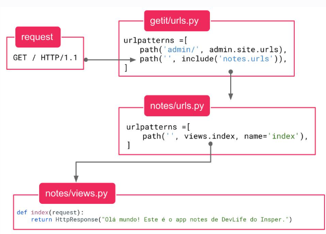

# points_of_change_2.0
python manage.py makemigrations.
python manage.py runserver
Coisas cridas: 
Comandos no terminal:

Mudança framework
Usarei este projeto para aprender django

URL => não são necessariamente páginas, você pode está em uma mesma página, mas com várias urls distintas. O uso das URLS está relacionada a mudanças com inputs, tando de clicks quanto de inputs.

Criar ambiente virtual há várias formas (pelo vs, pelo terminal do vs ou pelo terminal geral)
1° ctrl + shift + p (abre um termal diferencial de pesquisa)
2° criar => o resto é intuitivo

Criar as configurações
1° Pip install django
2° django-admin startproject getit .  (o arquivo será criado após isso)

Rodar servidor:
* python manage.py runserver

Criar o seu app
* python manage.py startapp points_of_change_2.0   (isso vai criar a pasta do app e o banco de dados)

Habilitar app
* Abra o arquivo getit/settings.py e procure por INSTALLED_APPS e adicione 'Nome.apps.NomeConfig', na primeira linha. Isso porque (Nome.config é uma classe que já foi criado: points_of_change_2), mas você pode ir nessas duas partes e mudar os nomes

Criar a tabela
* Faça a seguinte coisa em models.py, crie a tabela dessa forma:
* from django.db import models
  class Note(models.Model):
  title = models.CharField(max_length=200)

Faça a implementação da tabela:
1° python manage.py makemigrations
2° python manage.py migrate

Criar o admin
1° python manage.py createsuperuser (leia o terminal, ele irá lhe pedir o nome de usuário e as senhas)
2° python manage.py runserver => rode o servidor
3° em localrost, vá coloque /admin e acesse a página

Faça a tafera aparecer na página do admin
* Abra o arquivo SeuApp/admin.py e substitua o seu conteúdo por:
    from django.contrib import admin
    from .models import Sua_Classe
    admin.site.register(Sua_classe)

Existes dois arquivos "urls", neles se definem as urls, que transmitem informações para o servidor. Vá o urls do getit e escreva **não esqueça do include**:
* 
from django.contrib import admin
from django.urls import include, path
urlpatterns = [
    path('admin/', admin.site.urls),
    path('', include('nome_do_seu_app.urls')),
]
*

A coisa acima deu erro, **crie o arquivo urls.py** em nome_do_seu_app e faça o seguinte
* from django.urls import path

    from . import views

    urlpatterns = [
        path('', views.index, name='index'),
    ]

=> **veja que os arquivos urls são imendados entre si**. Ou seja, primerio você chama o do getit, de lá você chama o do nome_do_seu_app, com isso as urls desse outro serão percorridas. Por enquanto o getit só possui uma urls e outra lista de urls importadas com o include

=> as urls não são páginas. Elas são usadas para chamar uma função que pode ou não chamar uma página, mas a priore, executam uma função. Basicamente, você colocar as informações na URL e depois faz o requerimento ao servidor, o servidor pega as informações dessa URL e excuta funções e por fim retorna uma página ou um redireciomento.

Login:
* Você pode fazer a sua própria página de login ou pode usar a do django. Se usar a do django, precisa colocá-la em templas/registration. Se usa a sua, precisa criar a página de login ,precisa de uma nova rota e de uma nova model. O oo django também vai te dar o logout